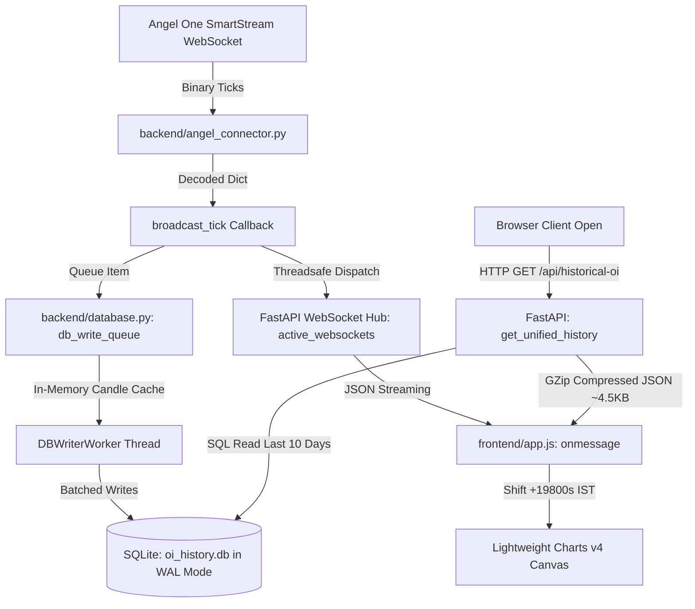

# System Architecture & Technical Manual: Real-Time Futures OI Terminal

> **Target Audience**: AI Agents and Engineers working on this codebase for the first time.
> **Last Updated**: September 2026

---

## 1. Executive Summary

This application is a **high-performance, real-time Open Interest (OI), Volume, and Price Charting Terminal** specifically engineered for **NCDEX (Agri-Commodities)** and **MCX (Metals & Energy)** futures.

Standard retail charting platforms (like TradingView) either charge high premiums or lack real-time intraday Open Interest and Cumulative Volume Delta (CVD) integration for Indian commodity derivatives. This project provides:
1. **Real-time Tick Ingestion** via Angel One SmartAPI / SmartStream WebSockets.
2. **High-Frequency Minute Candle Aggregation** (OHLC, Cumulative Volume, Open Interest, CVD).
3. **Multi-Series Synchronized Charting** using TradingView Lightweight Charts v4.
4. **Lightweight Low-Footprint Cloud Operation** optimized to run continuously on an **Oracle Cloud 512MB RAM Micro Instance** with zero swap thrashing.

---

## 2. Codebase Directory Structure

```
Project OI for dhaniya/
├── backend/
│   ├── main.py                 # FastAPI server, WebSocket hub, API endpoints & compression
│   ├── angel_connector.py      # Angel One SmartStream WebSocket client, session auth, streaming scrip master
│   ├── database.py             # SQLite WAL-mode schemas, in-memory tick cache, batch writer, query engine
│   ├── config.json             # Runtime configuration (active symbols, broker credentials, TV symbols)
│   ├── oi_history.db           # Persistent SQLite database (WAL mode, ~38 MB)
│   ├── angel_instruments.json  # Compact filtered scrip master (~260 NCDEX/MCX futures instruments, ~80 KB)
│   └── odin_connector.py       # Deprecated legacy broker connector (reference only)
├── frontend/
│   ├── index.html              # Dashboard UI, KPI cards, contract dropdowns, indicator toggles
│   ├── app.js                  # Frontend engine: Lightweight Charts v4, timescale sync, volume diff pipeline
│   ├── app.css                 # Responsive glassmorphic dark-theme design
│   ├── manifest.json           # PWA manifest for desktop/mobile installability
│   ├── sw.js                   # Service Worker for offline shell and asset caching
│   └── icon-512.png            # High-resolution PWA app icon
├── requirements.txt            # Python dependencies (fastapi, uvicorn, websockets, requests, psycopg2-binary)
├── run.bat                     # Windows one-click local launcher
├── Information.md              # THIS FILE: Complete agent architecture manual
└── project_resource_map.md     # Engineering log, historical incident root-causes & patch registry
```

---

## 3. End-to-End Data Pipeline & Architecture



### Component Details:
1. **AngelConnector (`backend/angel_connector.py`)**:
   * Authenticates with Angel One using TOTP, API Key, Client ID, and MPIN.
   * Maintains persistent WebSocket connection (`SmartStream WSS`).
   * Subscribes to configured contracts in `SNAP_QUOTE` mode (receives LTP, Open, High, Low, Close, Cumulative Volume, and Open Interest).
   * Automatically streams and filters the Angel scrip master on startup without memory overhead.
2. **Database Engine (`backend/database.py`)**:
   * Uses **SQLite in WAL mode** (`PRAGMA journal_mode = WAL; PRAGMA synchronous = NORMAL;`).
   * Background daemon thread `DBWriterWorker` drains ticks from a thread-safe `queue.Queue`.
   * **In-Memory Active Minute Cache (`_active_candle_cache`)**: Tracks each token's active minute candle in memory. Avoids executing SELECT queries on subsequent ticks within the same minute, cutting database reads by ~95%.
3. **API Server (`backend/main.py`)**:
   * FastAPI application bound to Uvicorn on `127.0.0.1:8000`.
   * Broadcasts live ticks to all active browser WebSockets via `asyncio.call_soon_threadsafe`.
   * Serves historical candles via `get_unified_history()`, merging raw database ticks with market open baselines and holiday guards.
   * Encapsulated in `GZipMiddleware` (compresses payloads by ~90%).
4. **Client UI (`frontend/app.js` & `index.html`)**:
   * Renders 4 synchronized TradingView Lightweight Charts: **Price (Candlestick + Volume)**, **Open Interest (Line/Area + Change in OI histogram)**, **RSI**, and **ATR**.
   * Translates timestamps using native UTC display methods offset by `+19800` seconds (+5.5h) to show perfect Indian Standard Time (IST).

---

## 4. Market Hours, Exchanges & Multi-Commodity Logic

The application tracks contracts across two separate exchanges with different schedules:

| Exchange | Tracked Commodities | Trading Hours (IST) | Volume Unit |
| :--- | :--- | :--- | :--- |
| **NCDEX** | `DHANIYA`, `GUARGUM5`, `JEERAMINI`, `JEERAUNJHA`, `TMCFGRNZM` | 10:00 AM – 5:00 PM (17:00) | Quintals (divided by 5 for lots) |
| **MCX** | `GOLD`, `GOLDM`, `SILVER`, `SILVERM` | 09:00 AM – 11:30 PM (23:30) | Lots (1 unit = 1 lot) |

### Exchange Rules Implemented:
* **Holiday Calendar (`NCDEX_HOLIDAYS_2026`)**: Defined in `database.py`. Prevents writing fake ticks or generating illiquid prefill candles on exchange holidays (Muharram, Diwali, Republic Day, etc.).
* **Dynamic Market Hours (`is_market_hours`)**: Automatically branches between NCDEX (10:00–17:00) and MCX (09:00–23:30) using the commodity prefix.
* **After-Hours Routing**: Ticks received after market close are pinned to the session's final closing minute timestamp so they do not corrupt the subsequent day's opening baseline.

---

## 5. Critical Technical Rules (DO NOT BREAK)

### 1. Volume Calculation Pipeline
* **In Database**: Volume is **cumulative** (total contracts traded from market open).
* **On Chart**: Volume must be **incremental per candle**.
* **Frontend Transformation (`applyTimeframe` in `app.js`)**:
  - Incremental volume = `current.volume - previous.volume`.
  - **Prefill Candles (`c.prefill === true`)**: Volume is forced to `0`.
  - **First Real Candle after Prefill (`prev.prefill === true`)**: Volume is taken as-is (equals cumulative volume at that point).
  - **Day Boundary**: When the date changes, the volume baseline resets.

### 2. Candle Open Price Rule
* In illiquid commodity futures, trades occur sporadically. If each candle's Open is set to the first tick of that bucket, candles display false color mismatches compared to exchange charts.
* **Rule**: Each intraday candle's `open` price is set equal to the **previous candle's `close` price**.

### 3. Time Bucketing Formula
When grouping ticks into multi-minute timeframes (5m, 15m, 1h):
```javascript
// MUST offset FIRST, then modulo:
const shifted = Math.floor(epochSeconds) + 19800;
const timeVal = shifted - (shifted % intervalSeconds);
```
> **Warning**: Never use `floor(time) - (floor(time) % interval) + offset`. For 1-hour intervals (`19800 % 3600 = 1800`), this produces half-hour timestamp distortions.

### 4. Timescale Synchronization Guards
All charts share a synchronized horizontal timescale. To avoid recursive range-setting loops:
* `isSyncingSuspended`: Set to `true` while loading history. **Must always be reset in a `finally` block**.
* `isSyncingRange`: Mutual-exclusion flag preventing infinite crosshair range broadcast loops.
* `isChartVisible(chart)`: Always check visibility before calling `setVisibleLogicalRange()`. Calling range methods on hidden indicators (`display:none`) throws unhandled JavaScript exceptions.

### 5. Contract Dropdown & Auto-Discovery
* The contract dropdown is dynamic: `/api/ncdex-contracts` extracts the expiry date from each token string (`_parse_expiry_from_token`) and automatically filters out expired contracts.
* When new futures are listed by the exchange, `auto_discover_contracts()` in `angel_connector.py` automatically scans the scrip master on startup, assigns TradingView symbols, adds them to `config.json`, and exposes them to the dropdown.

---

## 6. Production VM Deployment (Oracle Cloud AMD Micro)

### Infrastructure Specs:
* **Host IP**: `80.225.245.57` (`80-225-245-57.sslip.io`)
* **OS / Hardware**: Oracle Linux 9 / AMD EPYC Micro shape (**498 MB Physical RAM**, 1.5 GB Swap).
* **Systemd Service**: `ncdex.service` running Uvicorn on `127.0.0.1:8000` as user `opc`.
* **Reverse Proxy**: Nginx with SSL (Let's Encrypt Certbot) and native Gzip compression.
* **SSH Key Path**: `c:\Users\hp\Documents\ORACLE keys\ssh-key-2026-06-12.key`

### Safe Deployment Protocol:
Because the VM has a 512MB RAM constraint, **always stop the active service before updating files**:
```bash
# 1. Stop service to free RAM and release database locks
ssh -i "<key>" opc@80.225.245.57 "sudo systemctl stop ncdex"

# 2. Copy changed files
scp -i "<key>" backend/main.py opc@80.225.245.57:/home/opc/Project-OI-for-dhaniya/backend/main.py
scp -i "<key>" backend/angel_connector.py opc@80.225.245.57:/home/opc/Project-OI-for-dhaniya/backend/angel_connector.py
scp -i "<key>" backend/database.py opc@80.225.245.57:/home/opc/Project-OI-for-dhaniya/backend/database.py

# 3. Ensure proper file ownership (must be opc:opc, NOT root)
ssh -i "<key>" opc@80.225.245.57 "sudo chown -R opc:opc /home/opc/Project-OI-for-dhaniya/backend"

# 4. Restart service and verify
ssh -i "<key>" opc@80.225.245.57 "sudo systemctl start ncdex && systemctl status ncdex --no-pager"
```

---

## 7. Critical Gotchas for AI Agents

1. **NEVER open or search `angel_instruments.json` without line limits**:
   While now filtered to ~80 KB, raw scrip master dumps can reach 35 MB. Never run blanket ripgrep across it.
2. **PowerShell Quote Escaping on Windows**:
   When issuing SSH commands from Windows PowerShell, double quotes and nested single quotes inside Python one-liners (`python3 -c "..."`) will break. **Always write a `.py` script, `scp` it to `/tmp/`, and execute it via `ssh`**.
3. **Database Ownership**:
   If `oi_history.db` or its directory is ever touched by `root` during maintenance, SQLite will fail with `attempt to write a readonly database`, causing Uvicorn to loop indefinitely. Always ensure `opc:opc` ownership.
4. **Git vs Deployment**:
   The production VM does not have `git` installed to conserve memory. Deployments are performed via targeted `scp` from the local development repository.
