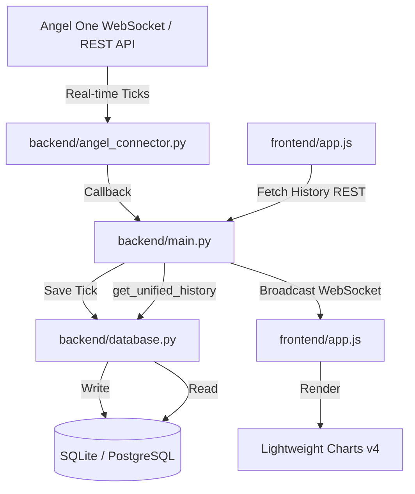

# Project Resource Map & Architecture Reference

This document provides a token-efficient, structural layout of the NCDEX Futures Real-Time Open Interest (OI) Charting Terminal. Refer to this map before making any new modifications to keep token consumption minimal.

---

## 📂 Codebase Directory Structure

```
Project OI for dhaniya/
├── backend/
│   ├── main.py                 # FastAPI Application Server & API endpoints
│   ├── angel_connector.py      # Angel One API connection, session management, mock feed
│   ├── database.py             # SQLite/PostgreSQL schemas & database writes/reads
│   ├── odin_connector.py       # Legacy / inactive connector (unused)
│   ├── config.json             # Persistent system configuration (active token, credentials, baselines)
│   ├── oi_history.db           # Local SQLite database (fallback for storage)
│   └── angel_instruments.json  # ⚠️ LARGE FILE (35MB). DO NOT SEARCH OR OPEN.
├── frontend/
│   ├── index.html              # HTML Dashboard (layouts, forms, KPIs, chart placeholders)
│   ├── app.js                  # Frontend app logic (Lightweight Charts v4, hover legends, websockets)
│   └── app.css                 # Glassmorphic dark theme CSS styling
├── requirements.txt            # Python dependencies (fastapi, uvicorn, websockets, psycopg2-binary)
├── run.bat                     # Windows startup script for local running
└── project_resource_map.md     # This file (Agent Developer Guide)
```

---

## 🛠️ System Architecture & Data Flow



### 1. Database Schema (`ticks` Table)
Stored in SQLite (`backend/oi_history.db`) or PostgreSQL (determined by `DATABASE_URL` environment variable):
*   **id** (`INTEGER PRIMARY KEY AUTOINCREMENT` or `SERIAL`): Unique tick ID.
*   **timestamp** (`INTEGER`): Epoch timestamp.
*   **symbol** (`TEXT` / `VARCHAR(100)`): e.g., `"DHANIYA AUG 26"`.
*   **token** (`TEXT` / `VARCHAR(100)`): e.g., `"DHANIYA20AUG2026"`.
*   **price** (`REAL`): Last Traded Price (LTP).
*   **open_interest** (`INTEGER`): Current Open Interest.
*   **volume** (`INTEGER`): Cumulative contract volume since day open.

---

## ⏱️ Key Technical Design Specs

### 1. IST Timezone Synchronization
To display native Indian Standard Time (IST) on chart axes timezone-independently:
*   The **Frontend shifts all timestamps** by adding `+19800` seconds (+5.5 hours) before loading/updating chart series data.
*   Chart formatters (`tickMarkFormatter` and `localization.timeFormatter`) utilize **UTC time methods** (e.g. `getUTCHours()`, `getUTCMinutes()`, `getUTCDate()`) to interpret the shifted values back as local IST times.

### 2. Sparsity Prefill Simulation
NCDEX sessions run Monday-Friday, starting at **10:00 AM IST**. If there is missing data between 10:00 AM IST and the first logged tick:
*   `backend/main.py` fetches the last recorded tick of the previous day to use as today's starting OI and yesterday's close price baseline.
*   It generates 1-minute pre-fill candles with random illiquid noise to bridge the gap up to the first live logged tick.
*   Calculates the daily **Change in OI** using the opening OI baseline (recorded or manual setting override).

### 3. Dynamic Legend Mapping
*   `frontend/app.js` caches all current chart ticks inside a `currentHistoryData` list.
*   On **crosshair hover**, the exact OHLC, Volume, and Open Interest values are resolved from this cache and mapped to `#legend-open`, `#legend-high`, `#legend-low`, `#legend-close`, `#legend-volume`, and `#legend-oi`.
*   When the cursor leaves the chart, the legend defaults to the **latest live candle's values**.

---

## 🚨 Agent Developer Guidelines (Token Savings)

> [!WARNING]
> **1. NEVER search or open `backend/angel_instruments.json`**
> This file is 35MB. Parsing, searching, or opening it directly will exhaust the context limit or cause prompt failures. If you need details on token mapping, view `backend/config.json` or write a targeted Python query script in `scratch/` instead.
>
> **2. Limit search scopes**
> Specify absolute subdirectory paths (`frontend` or `backend`) in search tools. Do not run glob searches across the entire workspace unless necessary.
>
> **3. Target line ranges in reads**
> Use `StartLine` and `EndLine` parameters in `view_file` to inspect code. Avoid loading the entire content of large files like `app.js` or `main.py` in single operations.
