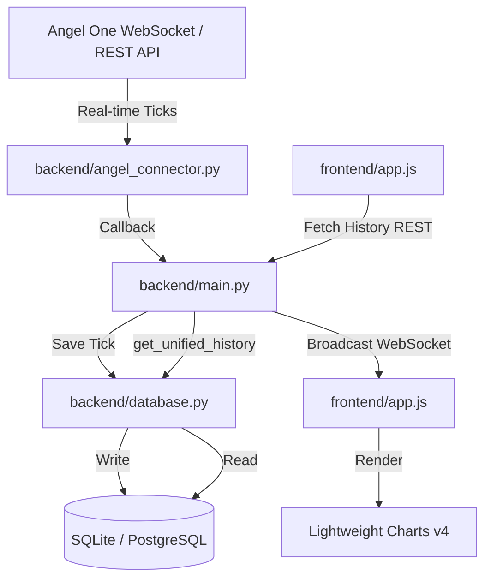

# Project Resource Map & Architecture Reference

This document provides a token-efficient, structural layout of the NCDEX Futures Real-Time Open Interest (OI) Charting Terminal. Refer to this map before making any new modifications to keep token consumption minimal.

---

## 📂 Codebase Directory Structure

```
Project OI for dhaniya/
├── backend/
│   ├── main.py                 # FastAPI Application Server & API endpoints
│   ├── angel_connector.py      # Angel One API connection, session management, mock feed
│   ├── database.py             # SQLite/PostgreSQL schemas & database writes/reads
│   ├── odin_connector.py       # Legacy / inactive connector (unused)
│   ├── config.json             # Persistent system configuration (active token, credentials, baselines)
│   ├── oi_history.db           # Local SQLite database (fallback for storage)
│   └── angel_instruments.json  # ⚠️ LARGE FILE (35MB). DO NOT SEARCH OR OPEN.
├── frontend/
│   ├── index.html              # HTML Dashboard (layouts, forms, KPIs, chart placeholders, PWA elements)
│   ├── app.js                  # Frontend app logic (Lightweight Charts v4, hover legends, websockets)
│   ├── app.css                 # Glassmorphic dark theme CSS styling
│   ├── manifest.json           # PWA manifest file for app installability
│   ├── sw.js                   # Service worker for static asset caching
│   └── icon-512.png            # PWA home screen app icon
├── requirements.txt            # Python dependencies (fastapi, uvicorn, websockets, psycopg2-binary)
├── run.bat                     # Windows startup script for local running
└── project_resource_map.md     # This file (Agent Developer Guide)
```

---

## 🛠️ System Architecture & Data Flow


```mermaid
graph TD
    A[Angel One WebSocket / REST API] -->|Real-time Ticks| B[backend/angel_connector.py]
    B -->|Callback| C[backend/main.py]
    C -->|Save Tick| D[backend/database.py]
    D -->|Write| E[(SQLite / PostgreSQL)]
    C -->|Broadcast WebSocket| F[frontend/app.js]
    F -->|Render| G[Lightweight Charts v4]
    
    H[frontend/app.js] -->|Fetch History REST| C
    C -->|get_unified_history| D
    D -->|Read| E
```

### 1. Database Schema (`ticks` Table)
Stored in SQLite (`backend/oi_history.db`) or PostgreSQL (determined by `DATABASE_URL` environment variable):
*   **id** (`INTEGER PRIMARY KEY AUTOINCREMENT` or `SERIAL`): Unique tick ID.
*   **timestamp** (`INTEGER`): Epoch timestamp.
*   **symbol** (`TEXT` / `VARCHAR(100)`): e.g., `"DHANIYA AUG 26"`.
*   **token** (`TEXT` / `VARCHAR(100)`): e.g., `"DHANIYA20AUG2026"`.
*   **open** (`REAL`): Candle Open Price.
*   **high** (`REAL`): Candle High Price.
*   **low** (`REAL`): Candle Low Price.
*   **close** (`REAL`): Candle Close Price (LTP).
*   **open_interest** (`INTEGER`): Current Open Interest.
*   **volume** (`INTEGER`): Cumulative contract volume since day open.

---

## ⏱️ Key Technical Design Specs

### 1. IST Timezone Synchronization
To display native Indian Standard Time (IST) on chart axes timezone-independently:
*   The **Frontend shifts all timestamps** by adding `+19800` seconds (+5.5 hours) before loading/updating chart series data.
*   Chart formatters (`tickMarkFormatter` and `localization.timeFormatter`) utilize **UTC time methods** (e.g. `getUTCHours()`, `getUTCMinutes()`, `getUTCDate()`) to interpret the shifted values back as local IST times.

### 2. Sparsity Prefill Simulation
NCDEX sessions run Monday-Friday, starting at **10:00 AM IST**. If there is missing data between 10:00 AM IST and the first logged tick:
*   `backend/main.py` fetches the last recorded tick of the previous day to use as today's starting OI and yesterday's close price baseline.
*   It generates 1-minute pre-fill candles with random illiquid noise to bridge the gap up to the first live logged tick.
*   Calculates the daily **Change in OI** using the opening OI baseline (recorded or manual setting override).
*   **Prefill candles include `"prefill": True`** in their dict so the frontend can distinguish them from real exchange data.

### 3. Volume Bar Calculation Pipeline
Volume in the database is **cumulative** (total contracts traded since market open). The frontend converts this to **per-candle incremental volume** for chart rendering. The pipeline is:

1.  **Backend** (`database.py` `save_tick`): Stores raw cumulative volume from Angel One as-is.
2.  **Backend** (`database.py` `get_history`): Returns 1-minute OHLCV candles aggregated from raw ticks. Volume uses `max()` (correct for cumulative — latest tick has highest value).
3.  **Backend** (`main.py` `get_unified_history`): Merges `past_ticks + prefill_candles + session_ticks`. Prefill candles have `"prefill": True`.
4.  **Frontend** (`app.js` `applyTimeframe`):
    *   Filters for market hours, then maps each 1-min candle to incremental volume via `diff = current.volume - previous.volume`.
    *   **Prefill candles** (`c.prefill === true`): Volume diff is forced to `0` — they have fake cumulative values.
    *   **First real candle after prefill** (`prev.prefill === true`): Uses `c.volume` as-is (represents total contracts traded since market open).
    *   **Day boundary**: If the day changes, handles broker volume carry-over vs reset.
    *   **Negative diff** (volume reset mid-day): Treats the candle's cumulative value as the full incremental volume.
5.  **Frontend** (`app.js` `handleLiveTick`): For live WebSocket ticks, the same incremental logic applies using `activeMinuteVolumeStart` as baseline.

> [!IMPORTANT]
> **Volume is cumulative in the DB, incremental on the chart.** If volume bars ever look wrong, check the diff logic in `applyTimeframe()` (~line 1565) first. The `prefill` flag boundary is the most common source of spurious spikes.

### 4. Live Tick Time Alignment
The time bucket formula for grouping candles into timeframe intervals (5m, 15m, 1h, etc.) **must be identical** in both `applyTimeframe()` (historical) and `handleLiveTick()` (live):

```javascript
// Correct formula (offset FIRST, then floor to interval boundary):
const shifted = Math.floor(epochSeconds) + 19800;  // shift UTC → IST
const timeVal = shifted - (shifted % intervalSeconds);  // floor to interval
```

> [!CAUTION]
> **Do NOT use**: `floor(time) - (floor(time) % interval) + offset`. This produces different buckets when `offset % interval ≠ 0` (e.g., on 1-hour timeframe: `19800 % 3600 = 1800`). The mismatch causes live candles to land in different buckets than historical candles, creating visual timestamp shifts.

### 3. Dynamic Legend Mapping
*   `frontend/app.js` caches all current chart ticks inside a `currentHistoryData` list.
*   On **crosshair hover**, the exact OHLC, Volume, and Open Interest values are resolved from this cache and mapped to `#legend-open`, `#legend-high`, `#legend-low`, `#legend-close`, `#legend-volume`, and `#legend-oi`.
*   When the cursor leaves the chart, the legend defaults to the **latest live candle's values**.

### 5. Active Contract Switching & Reconnection
*   Changing contracts is done via dropdown value selection on the client. It sends a WebSocket message `change_symbol` to update backend in-memory settings (written to `config.json`).
*   **No WS Restart Needed**: The connector remains active, filtering and broadcasting ticks dynamically.
*   **Reconnection Sync**: On WebSocket `onopen`, the client sends the currently selected symbol to backend to ensure they stay synced.
*   **History Reload on Reconnect**: When the WebSocket reconnects (not initial connect), the frontend automatically calls `loadOIHistory(currentSymbol)` to fill any data gaps that occurred during the disconnection. Controlled by the `isInitialWsConnect` flag in `app.js`.
*   **Chart Cleanups**: Price and OI charts must be disposed of via `chart.remove()` prior to recreating instances to avoid zombie logical range handlers.

### 6. Dynamic Contract Dropdown (Auto-Discovery & Expiry Filtering)
The contract dropdown is fully dynamic — no manual config edits needed when contracts expire or new ones are listed.

#### Expiry Filtering (Backend → Frontend)
*   **`/api/ncdex-contracts`** endpoint in `main.py` parses the expiry date embedded in each contract's Angel One token string (e.g., `DHANIYA19JUN2026` → June 19, 2026) using `_parse_expiry_from_token()`.
*   Contracts whose expiry date has passed are **automatically excluded** from the API response.
*   Optional query param `?include_expired=true` available for historical viewing.
*   Frontend `populateContractsDropdown()` in `app.js` handles the case where the active symbol was filtered out — it automatically selects the first available contract.

#### Auto-Discovery of New Contracts (Startup)
*   **`auto_discover_contracts()`** method in `angel_connector.py` runs once on service startup (called in `main.py` `startup_event`).
*   Scans the Angel One scrip master (`angel_instruments.json`, refreshed daily) for all `NCDEX FUTCOM` instruments matching tracked commodity codes (extracted from existing `futures_symbols` keys).
*   For each new contract found, it:
    1. Parses the expiry date from the token to build a display name (e.g., `DHANIYA20FEB2027` → `DHANIYA FEB 27`).
    2. Generates the TradingView symbol using the existing template for that commodity (continuous `1!` style or individual month letter style).
    3. Adds the entry to `futures_symbols` in config and saves `config.json`.
*   **Memory impact**: Negligible — runs once, loads the already-filtered scrip master (~87 instruments), then frees all local variables.
*   **Tracked commodities** are inferred from existing `futures_symbols` keys: `DHANIYA`, `GUARGUM5`, `JEERAMINI`, `JEERAUNJHA`, `TMCFGRNZM`.

> [!TIP]
> To add a completely new commodity to tracking, manually add one contract for it in `config.json` under `futures_symbols`. On next restart, `auto_discover_contracts()` will pick up all other listed contracts for that commodity automatically.

### 7. Chart Synchronization Guards
Multiple charts (Price, OI, RSI, ATR) share a synchronized timescale. Key guards:
*   **`isSyncingSuspended`**: Set to `true` during history load / timeframe change. Reset in a `finally` block inside `setTimeout`. **Must always be reset** — if an exception prevents the `finally`, sync breaks permanently.
*   **`isSyncingRange`**: Mutual exclusion guard to prevent recursive `setVisibleLogicalRange()` update loops between charts.
*   **`isChartVisible(chart)`**: Before calling `setVisibleLogicalRange()` on any chart, check visibility. Hidden charts (`display:none`) throw exceptions on range calls.
*   When toggling RSI/ATR indicators, call `.resize()` on **all visible charts** to recalculate flex layout.

---

## 🚨 Agent Developer Guidelines (Token Savings)

> [!WARNING]
> **1. NEVER search or open `backend/angel_instruments.json`**
> This file is 35MB. Parsing, searching, or opening it directly will exhaust the context limit or cause prompt failures. If you need details on token mapping, view `backend/config.json` or write a targeted Python query script in `scratch/` instead.
>
> **2. Limit search scopes**
> Specify absolute subdirectory paths (`frontend` or `backend`) in search tools. Do not run glob searches across the entire workspace unless necessary.
>
> **3. Target line ranges in reads**
> Use `StartLine` and `EndLine` parameters in `view_file` to inspect code. Avoid loading the entire content of large files like `app.js` or `main.py` in single operations.

---

## 🖥️ Server Deployment & VM Memory Constraints (OCI Free Tier)

> [!IMPORTANT]
> **1. Memory Limits & Swap Space**
> OCI AMD Compute Instances (`VM.Standard.E2.1.Micro`) only have **1 GB RAM**. To prevent system freezes during package installations, **ensure swap space is active** (at least 1.5 GB). Use `swapon --show` to verify active swapfiles.
>
> **2. DNF Package Manager Memory Optimizations**
> The DNF package manager is extremely heavy on RAM when loading repo metadata, which can easily trigger Out-Of-Memory (OOM) lockups on a 1GB VM shape.
> * Always run `sudo dnf clean all` before installing.
> * **NEVER** let DNF load all default repositories (especially `ol9_ksplice` and `ol9_oci_included` metadata, which are massive).
> * Explicitly exclude heavy repositories when running installation commands:
>   `sudo dnf install -y <packages> --disablerepo=ol9_ksplice --disablerepo=ol9_oci_included --disablerepo=ol9_addons --disablerepo=ol9_codeready`
>
> **3. Safe Deployment Protocol (Preventing Freezes)**
> Due to heavy RAM and disk I/O constraints on the OCI micro shape, always stop the active FastAPI service prior to pulling repository updates or installing new dependencies. This frees memory and stops active database writes:
> *   **Step 1 (Stop Service)**: `sudo systemctl stop ncdex`
> *   **Step 2 (Pull & Update)**: `git pull` (and run dependency installations/migrations if needed)
> *   **Step 3 (Start Service)**: `sudo systemctl start ncdex`

---

## 🌐 Production Deployment Infrastructure Reference

### 1. Host Information
* **Public IP**: `80.225.245.57` (Oracle Cloud VM, `opc` user, standard SSH key)
* **Domain**: `80-225-245-57.sslip.io` (Resolves to the VM IP)
* **Ports**: Port `80` (HTTP) redirects to HTTPS, Port `443` (HTTPS) is open to the public.

### 2. Nginx Reverse Proxy
* **Configuration File**: `/etc/nginx/conf.d/ncdex.conf`
* **Purpose**: Performs SSL termination and routes traffic to FastAPI on port 8000.
* **WebSocket Proxies**: Location `/ws` is configured with `Upgrade` and `Connection` headers to support live WebSocket data streaming.

### 3. Let's Encrypt SSL
* **Cert Path**: `/etc/letsencrypt/live/80-225-245-57.sslip.io/fullchain.pem`
* **Key Path**: `/etc/letsencrypt/live/80-225-245-57.sslip.io/privkey.pem`
* **Authenticator**: Certbot standalone (runs renewals automatically using `certbot-renew.timer`).

### 4. FastAPI Service (systemd)
* **Service File**: `/etc/systemd/system/ncdex.service`
* **Port**: Bound to `127.0.0.1:8000` (localhost only).
* **Execution User**: Runs as `opc` user for security.
* **Database Ownership**: The database `/home/opc/Project-OI-for-dhaniya/backend/oi_history.db` must belong to the `opc:opc` user. If owned by `root`, SQLite writes will fail, causing the service to lock up in an infinite database connection retry loop.

### 5. SSH Key Path & Quick Deploy Commands
* **SSH Key**: `c:\Users\hp\Documents\ORACLE keys\ssh-key-2026-06-12.key`
* **SSH command pattern**: `ssh -o StrictHostKeyChecking=no -i "c:\Users\hp\Documents\ORACLE keys\ssh-key-2026-06-12.key" opc@80.225.245.57 "<command>"`
* **SCP deploy pattern**: `scp -o StrictHostKeyChecking=no -i "c:\Users\hp\Documents\ORACLE keys\ssh-key-2026-06-12.key" <local_file> opc@80.225.245.57:<remote_path>`
* **Quick deploy & restart**:
  1. Copy changed files: `scp ... backend/main.py opc@80.225.245.57:/home/opc/Project-OI-for-dhaniya/backend/main.py`
  2. Copy frontend: `scp ... frontend/app.js opc@80.225.245.57:/home/opc/Project-OI-for-dhaniya/frontend/app.js`
  3. Restart: `ssh ... "sudo systemctl restart ncdex"`
  4. Verify: `ssh ... "sudo systemctl status ncdex --no-pager"`
* **View live logs**: `ssh ... "sudo journalctl -u ncdex -f --no-pager"`
* **Run DB queries**: Write a `.py` script locally, `scp` it to `/tmp/` on the VM, then `ssh ... "python3 /tmp/script.py"`. The VM does **not** have `psycopg2` — use `sqlite3` module directly against `/home/opc/Project-OI-for-dhaniya/backend/oi_history.db`.

> [!WARNING]
> **PowerShell quoting**: The local shell is PowerShell on Windows. Inline Python one-liners with quotes/brackets break due to PS parsing. Always write a `.py` file and `scp` + `ssh` execute it instead of trying inline `-c` commands.

---

## 📋 Known Issues & Past Fixes Log

| Date | Issue | Root Cause | Fix Applied |
|------|-------|------------|-------------|
| 2026-06-17 | Chart sync breaks after toggling indicators | `isSyncingSuspended` locked permanently because `setVisibleLogicalRange()` on hidden charts threw unhandled exceptions | Wrapped all `setVisibleLogicalRange()` in `try-catch` with `finally` to guarantee `isSyncingSuspended = false`. Added `isChartVisible()` guard. |
| 2026-06-24 | Volume bars differ from TradingView | Prefill candles had fake cumulative volumes polluting the diff calculation; live tick `timeVal` formula misaligned with historical aggregation | Backend: added `"prefill": True` flag to prefill candles. Frontend: zeroed prefill volume in `applyTimeframe()`, fixed `timeVal` formula to offset-first-then-modulo. |
| 2026-06-24 | Chart data gap after WebSocket disconnection | Frontend did not reload historical data on WS reconnect, leaving gaps in `raw1mHistory` | Added `isInitialWsConnect` flag in `app.js`. On reconnect (not first connect), `loadOIHistory()` is called automatically to backfill gaps. |
| 2026-06-25 | Expired contracts (JUN 26) still shown in dropdown | Contract dropdown was static — populated from `futures_symbols` in `config.json` with no expiry filtering | Added `_parse_expiry_from_token()` in `main.py` to parse expiry dates from Angel One tokens. `/api/ncdex-contracts` now filters out expired contracts by default. Updated `active_symbol` from expired `DHANIYA JUN 26` to `DHANIYA AUG 26`. |
| 2026-06-25 | New NCDEX contracts not auto-added to dropdown | No mechanism to discover newly listed contracts from Angel One scrip master | Added `auto_discover_contracts()` in `angel_connector.py`. Runs on startup, scans scrip master for new FUTCOM contracts matching tracked commodities, auto-adds to `futures_symbols` and saves config. |
| 2026-06-27 | Fake chart data on NCDEX holidays (e.g., Muharram June 26) | `is_market_hours()`, `get_last_market_minute()`, and `get_unified_history()` only checked weekends, not exchange holidays. Stale REST quotes got written to DB on holidays. | Added `NCDEX_HOLIDAYS_2026` set and `is_ncdex_holiday()` to `database.py`. Updated all three functions to skip holidays. Cleaned 20 bogus ticks from DB. |
| 2026-07-07 | Intraday highs/lows missing from chart candles | `_db_writer_worker` heartbeat path (no-trade ticks) only updated `close` — never touched `high`/`low`. Price spikes arriving in heartbeat ticks were lost. | Updated heartbeat UPDATE in `database.py` to always compute `max(high, price)` and `min(low, price)`. |
| 2026-07-07 | Candle colors differ from TradingView (green vs red) | Frontend used first-tick-of-interval as candle open, while TradingView uses previous candle's close. Causes color mismatch in illiquid markets. | `applyTimeframe()` and `handleLiveTick()` now set each candle's open = previous candle's close (intraday only). |
| 2026-07-08 | OI summary table showed expired JUN 26 contracts | `get_commodity_curve_history()` included all `futures_symbols` without filtering expired contracts. | Added `_parse_expiry_from_token()` filtering (same as dropdown) and `is_ncdex_holiday()` for weekday list. |
| 2026-07-08 | Mobile app support (PWA) | Terminal only usable on desktop browsers. | Added `manifest.json`, `sw.js` (service worker), app icon, Apple meta tags. Terminal is now installable on Android/iOS as a standalone app. |
| 2026-09-06 | High peak memory (~222MB), swap churn, and uncompressed payloads on VM | Full 40MB JSON parsed into heap memory during scrip sync; SQLite in default DELETE journal mode with 2 SELECTs per tick; 5-yr tick retention; uncompressed JSON responses. | Streamed scrip master download (peak RAM < 20MB); switched SQLite to WAL mode; added in-memory active minute tick caching in `_db_writer_worker`; reduced prune retention to 60 days + VACUUM; enabled Gzip in FastAPI & Nginx; tuned `vm.swappiness=10`. Peak memory dropped from 222MB to 57MB, swap eliminated (0 kB). |

