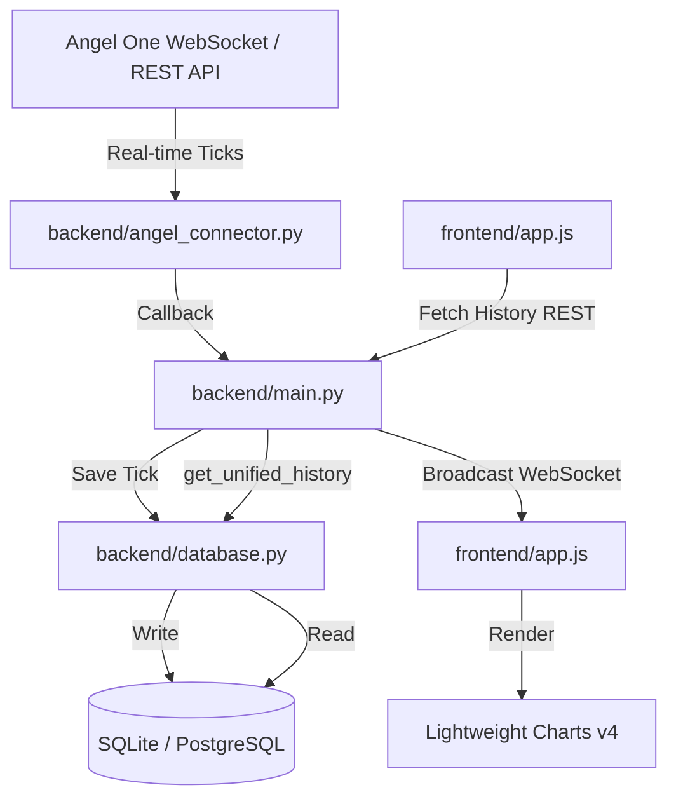

# Project Resource Map & Architecture Reference

This document provides a token-efficient, structural layout of the NCDEX Futures Real-Time Open Interest (OI) Charting Terminal. Refer to this map before making any new modifications to keep token consumption minimal.

---

## 📂 Codebase Directory Structure

```
Project OI for dhaniya/
├── backend/
│   ├── main.py                 # FastAPI Application Server & API endpoints
│   ├── angel_connector.py      # Angel One API connection, session management, mock feed
│   ├── database.py             # SQLite/PostgreSQL schemas & database writes/reads
│   ├── odin_connector.py       # Legacy / inactive connector (unused)
│   ├── config.json             # Persistent system configuration (active token, credentials, baselines)
│   ├── oi_history.db           # Local SQLite database (fallback for storage)
│   └── angel_instruments.json  # ⚠️ LARGE FILE (35MB). DO NOT SEARCH OR OPEN.
├── frontend/
│   ├── index.html              # HTML Dashboard (layouts, forms, KPIs, chart placeholders)
│   ├── app.js                  # Frontend app logic (Lightweight Charts v4, hover legends, websockets)
│   └── app.css                 # Glassmorphic dark theme CSS styling
├── requirements.txt            # Python dependencies (fastapi, uvicorn, websockets, psycopg2-binary)
├── run.bat                     # Windows startup script for local running
└── project_resource_map.md     # This file (Agent Developer Guide)
```

---

## 🛠️ System Architecture & Data Flow


```mermaid
graph TD
    A[Angel One WebSocket / REST API] -->|Real-time Ticks| B[backend/angel_connector.py]
    B -->|Callback| C[backend/main.py]
    C -->|Save Tick| D[backend/database.py]
    D -->|Write| E[(SQLite / PostgreSQL)]
    C -->|Broadcast WebSocket| F[frontend/app.js]
    F -->|Render| G[Lightweight Charts v4]
    
    H[frontend/app.js] -->|Fetch History REST| C
    C -->|get_unified_history| D
    D -->|Read| E
```

### 1. Database Schema (`ticks` Table)
Stored in SQLite (`backend/oi_history.db`) or PostgreSQL (determined by `DATABASE_URL` environment variable):
*   **id** (`INTEGER PRIMARY KEY AUTOINCREMENT` or `SERIAL`): Unique tick ID.
*   **timestamp** (`INTEGER`): Epoch timestamp.
*   **symbol** (`TEXT` / `VARCHAR(100)`): e.g., `"DHANIYA AUG 26"`.
*   **token** (`TEXT` / `VARCHAR(100)`): e.g., `"DHANIYA20AUG2026"`.
*   **open** (`REAL`): Candle Open Price.
*   **high** (`REAL`): Candle High Price.
*   **low** (`REAL`): Candle Low Price.
*   **close** (`REAL`): Candle Close Price (LTP).
*   **open_interest** (`INTEGER`): Current Open Interest.
*   **volume** (`INTEGER`): Cumulative contract volume since day open.

---

## ⏱️ Key Technical Design Specs

### 1. IST Timezone Synchronization
To display native Indian Standard Time (IST) on chart axes timezone-independently:
*   The **Frontend shifts all timestamps** by adding `+19800` seconds (+5.5 hours) before loading/updating chart series data.
*   Chart formatters (`tickMarkFormatter` and `localization.timeFormatter`) utilize **UTC time methods** (e.g. `getUTCHours()`, `getUTCMinutes()`, `getUTCDate()`) to interpret the shifted values back as local IST times.

### 2. Sparsity Prefill Simulation
NCDEX sessions run Monday-Friday, starting at **10:00 AM IST**. If there is missing data between 10:00 AM IST and the first logged tick:
*   `backend/main.py` fetches the last recorded tick of the previous day to use as today's starting OI and yesterday's close price baseline.
*   It generates 1-minute pre-fill candles with random illiquid noise to bridge the gap up to the first live logged tick.
*   Calculates the daily **Change in OI** using the opening OI baseline (recorded or manual setting override).

### 3. Dynamic Legend Mapping
*   `frontend/app.js` caches all current chart ticks inside a `currentHistoryData` list.
*   On **crosshair hover**, the exact OHLC, Volume, and Open Interest values are resolved from this cache and mapped to `#legend-open`, `#legend-high`, `#legend-low`, `#legend-close`, `#legend-volume`, and `#legend-oi`.
*   When the cursor leaves the chart, the legend defaults to the **latest live candle's values**.

### 4. Active Contract Switching & Reconnection
*   Changing contracts is done via dropdown value selection on the client. It sends a WebSocket message `change_symbol` to update backend in-memory settings (written to `config.json`).
*   **No WS Restart Needed**: The connector remains active, filtering and broadcasting ticks dynamically.
*   **Reconnection Sync**: On WebSocket `onopen`, the client sends the currently selected symbol to backend to ensure they stay synced.
*   **Chart Cleanups**: Price and OI charts must be disposed of via `chart.remove()` prior to recreating instances to avoid zombie logical range handlers.

---

## 🚨 Agent Developer Guidelines (Token Savings)

> [!WARNING]
> **1. NEVER search or open `backend/angel_instruments.json`**
> This file is 35MB. Parsing, searching, or opening it directly will exhaust the context limit or cause prompt failures. If you need details on token mapping, view `backend/config.json` or write a targeted Python query script in `scratch/` instead.
>
> **2. Limit search scopes**
> Specify absolute subdirectory paths (`frontend` or `backend`) in search tools. Do not run glob searches across the entire workspace unless necessary.
>
> **3. Target line ranges in reads**
> Use `StartLine` and `EndLine` parameters in `view_file` to inspect code. Avoid loading the entire content of large files like `app.js` or `main.py` in single operations.

---

## 🖥️ Server Deployment & VM Memory Constraints (OCI Free Tier)

> [!IMPORTANT]
> **1. Memory Limits & Swap Space**
> OCI AMD Compute Instances (`VM.Standard.E2.1.Micro`) only have **1 GB RAM**. To prevent system freezes during package installations, **ensure swap space is active** (at least 1.5 GB). Use `swapon --show` to verify active swapfiles.
>
> **2. DNF Package Manager Memory Optimizations**
> The DNF package manager is extremely heavy on RAM when loading repo metadata, which can easily trigger Out-Of-Memory (OOM) lockups on a 1GB VM shape.
> * Always run `sudo dnf clean all` before installing.
> * **NEVER** let DNF load all default repositories (especially `ol9_ksplice` and `ol9_oci_included` metadata, which are massive).
> * Explicitly exclude heavy repositories when running installation commands:
>   `sudo dnf install -y <packages> --disablerepo=ol9_ksplice --disablerepo=ol9_oci_included --disablerepo=ol9_addons --disablerepo=ol9_codeready`
>
> **3. Safe Deployment Protocol (Preventing Freezes)**
> Due to heavy RAM and disk I/O constraints on the OCI micro shape, always stop the active FastAPI service prior to pulling repository updates or installing new dependencies. This frees memory and stops active database writes:
> *   **Step 1 (Stop Service)**: `sudo systemctl stop ncdex`
> *   **Step 2 (Pull & Update)**: `git pull` (and run dependency installations/migrations if needed)
> *   **Step 3 (Start Service)**: `sudo systemctl start ncdex`

---

## 🌐 Production Deployment Infrastructure Reference

### 1. Host Information
* **Public IP**: `80.225.245.57` (Oracle Cloud VM, `opc` user, standard SSH key)
* **Domain**: `80-225-245-57.sslip.io` (Resolves to the VM IP)
* **Ports**: Port `80` (HTTP) redirects to HTTPS, Port `443` (HTTPS) is open to the public.

### 2. Nginx Reverse Proxy
* **Configuration File**: `/etc/nginx/conf.d/ncdex.conf`
* **Purpose**: Performs SSL termination and routes traffic to FastAPI on port 8000.
* **WebSocket Proxies**: Location `/ws` is configured with `Upgrade` and `Connection` headers to support live WebSocket data streaming.

### 3. Let's Encrypt SSL
* **Cert Path**: `/etc/letsencrypt/live/80-225-245-57.sslip.io/fullchain.pem`
* **Key Path**: `/etc/letsencrypt/live/80-225-245-57.sslip.io/privkey.pem`
* **Authenticator**: Certbot standalone (runs renewals automatically using `certbot-renew.timer`).

### 4. FastAPI Service (systemd)
* **Service File**: `/etc/systemd/system/ncdex.service`
* **Port**: Bound to `127.0.0.1:8000` (localhost only).
* **Execution User**: Runs as `opc` user for security.
* **Database Ownership**: The database `/home/opc/Project-OI-for-dhaniya/backend/oi_history.db` must belong to the `opc:opc` user. If owned by `root`, SQLite writes will fail, causing the service to lock up in an infinite database connection retry loop.
